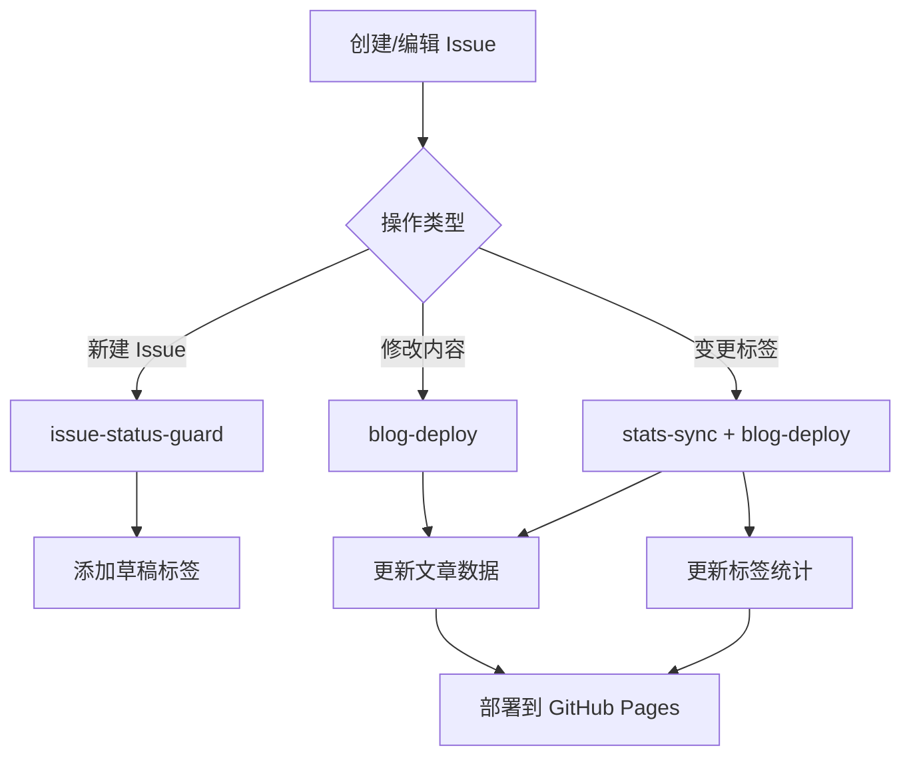

# Cyclone77 博客

基于 GitHub Issues 的现代技术博客，使用 React 19 + TypeScript 5 + Vite 6 构建。

## 技术栈

- **React 19** - 最新的 React 版本
- **TypeScript 5** - 类型安全
- **Vite 6** - 快速的构建工具
- **Tailwind CSS 3** - 实用优先的 CSS 框架
- **React Router 7** - 现代路由管理
- **GitHub Issues** - 内容管理系统
- **GitHub Actions** - 自动化构建和部署

## 功能特性

- ✨ 现代化的 UI 设计
- 🌓 深色/浅色主题切换
- 📱 完全响应式设计
- 🚀 基于 GitHub Issues 的内容管理
- ⚡ 极快的页面加载速度
- 🎨 精美的代码高亮
- 🏷️ 智能标签系统
- 💬 原生评论系统（Issues Comments）

---

## 📝 如何发布文章

### 1. 创建文章

1. 在 GitHub 仓库中创建一个新的 **Issue**
2. 编写标题和内容（支持 Markdown）
3. Issue 会自动添加 `状态:草稿` 标签

### 2. 添加分类和标签

为文章添加合适的标签：

#### 必选：分类标签（至少选一个）

- `分类:前端开发`
- `分类:后端开发`
- `分类:DevOps`
- `分类:人工智能`
- `分类:系统设计`
- `分类:教程`
- `分类:经验分享`

#### 可选：功能标签

- `功能:置顶` - 文章会在首页置顶
- `功能:精选` - 文章会在 Hero 区域展示
- `功能:热门` - 文章会在热门推荐中显示

#### 可选：技术标签（无前缀）

直接添加技术名称，如：

- `React`
- `TypeScript`
- `Docker`
- `性能优化`
- `最佳实践`

### 3. 发布文章

1. 添加 `状态:已发布` 标签
2. 系统会自动：
    - 移除 `状态:草稿` 标签
    - 触发 GitHub Actions 构建
    - 生成文章数据
    - 部署到博客网站
3. 几分钟后，文章就会出现在博客上

### 4. 管理文章

#### 归档文章

- 添加 `状态:已归档` 标签
- 文章会移到归档页面，不在首页显示

#### 作废文章

- 添加 `状态:已作废` 标签
- 文章将完全不显示

#### 编辑文章

- 直接编辑 Issue 内容
- 保存后会自动触发重新构建

---

## 🏷️ 标签系统说明

### 标签前缀规则

| 前缀    | 用途     | 颜色           | 说明                     |
| ------- | -------- | -------------- | ------------------------ |
| `状态:` | 文章状态 | 蓝色 `#0969DA` | 只能有一个，系统自动互斥 |
| `分类:` | 文章分类 | 绿色 `#1A7F37` | 可以有多个               |
| `功能:` | 特殊功能 | 紫色 `#8250DF` | 可选，可组合             |
| 无前缀  | 普通标签 | 灰色 `#656D76` | 技术标签、主题标签       |

### 状态标签（系统管理）

- `状态:草稿` - 新建时自动添加，博客不显示
- `状态:已发布` - 博客正常显示
- `状态:已归档` - 归档页显示，首页不显示
- `状态:已作废` - 完全不显示

**注意：** 添加新状态标签时，系统会自动移除其他状态标签，保证只有一个状态。

---

## 🎯 使用示例

### 示例 1：发布一篇前端教程

1. 创建 Issue，标题：`React 19 新特性详解`
2. 编写 Markdown 内容
3. 添加标签：
    - `分类:前端开发`
    - `分类:教程`
    - `React`
    - `JavaScript`
4. 添加 `状态:已发布` 标签
5. 完成！

### 示例 2：发布置顶精选文章

1. 创建 Issue，标题：`2024 年 Web 开发技术趋势`
2. 编写内容
3. 添加标签：
    - `分类:经验分享`
    - `功能:置顶`
    - `功能:精选`
    - `Web开发`
    - `技术趋势`
4. 添加 `状态:已发布`
5. 文章会出现在首页置顶位置和精选区域

---

## ⚙️ GitHub Actions 工作流说明

本项目使用三个 GitHub Actions 工作流实现自动化：

### 1. `issue-status-guard.yml` - Issue 状态守卫

**触发时机：**

- Issue 创建时（`opened`）
- Issue 添加标签时（`labeled`）

**功能：**

- ✅ **自动添加草稿标签**：新建 Issue 时，如果没有状态标签，自动添加 `状态:草稿`
- ✅ **状态标签互斥**：添加新的状态标签时，自动移除其他状态标签，确保每篇文章只有一个状态

**工作原理：**

```yaml
新建 Issue → 检查是否有状态标签 → 没有则添加「状态:草稿」
添加状态标签 → 移除其他状态标签 → 保留最新状态
```

---

### 2. `stats-sync.yml` - 标签和分类统计同步

**触发时机：**

- Issue 标签变更（`labeled`, `unlabeled`）
- 手动触发（`workflow_dispatch`）
- 定时任务（每天凌晨 3 点）

**功能：**

- 📊 **标签统计同步**：自动统计所有技术标签的使用次数
- 📁 **分类统计同步**：自动统计各分类下的文章数量
- 🔄 **智能更新**：只在标签实际变化时才重新统计

**手动触发统计同步：**

1. 进入仓库的 `Actions` 页面
2. 选择 `Sync Labels and Categories` 工作流
3. 点击 `Run workflow` 按钮
4. 点击确认

---

### 3. `blog-deploy.yml` - 博客构建和部署

**触发时机：**

- Issue 内容编辑（`edited`）
- Issue 标签变更（`labeled`, `unlabeled`）
- 手动触发（`workflow_dispatch`）
- 定时任务（每周日凌晨 2 点）

**功能：**

- 📦 **增量构建**（默认）：只更新变更的文章，快速高效
- 🔄 **全量构建**（特殊情况）：手动触发或定时任务时，重新构建所有文章
- 🚀 **自动部署**：构建完成后自动部署到 GitHub Pages

**工作流程：**

```
1. 检测触发事件（编辑内容或标签变更）
2. 判断是否需要构建（草稿不触发）
3. 从 Issues 获取文章数据
4. 解析 Markdown 内容和标签
5. 生成 articles.json 文件
6. 构建前端项目（npm run build）
7. 部署到 GitHub Pages
```

**构建模式：**

| 模式     | 触发条件            | 处理方式         |
| -------- | ------------------- | ---------------- |
| 增量构建 | Issue 编辑/标签变更 | 只更新变化的文章 |
| 全量构建 | 手动触发/每周日定时 | 重新获取所有文章 |

**手动触发全量构建：**

1. 进入仓库的 `Actions` 页面
2. 选择 `Build and Deploy Blog` 工作流
3. 点击 `Run workflow`
4. 勾选 `执行全量构建`
5. 点击 `Run workflow` 确认

---

### 工作流协作机制



**关键特性：**

- ✅ **职责分离**：每个工作流专注单一职责
- ✅ **按需执行**：只在必要时才触发，节省资源
- ✅ **灵活控制**：支持手动触发和定时任务
- ✅ **智能判断**：草稿状态不触发构建

---

## 🔧 GitHub 仓库配置

### 快速配置（推荐）

1. **开启 GitHub Pages**
    - 进入仓库 `Settings` → `Pages`
    - Source 选择 `GitHub Actions`

2. **一键初始化标签** ⭐
    - 进入 `Actions` 页面
    - 运行 `Initialize Labels` 工作流
    - 所有预设标签自动创建完成！

### 手动配置（可选）

如果你想手动创建标签，可以在 `Issues` → `Labels` 中按以下规范创建：

**状态标签（蓝色 #0969DA）：**

- `状态:草稿` - 默认状态，博客不显示
- `状态:已发布` - 正式发布，博客可见
- `状态:已归档` - 归档页可见，首页不显示
- `状态:已作废` - 完全不显示

**分类标签（绿色 #1A7F37）：**

- `分类:前端开发` - 前端技术相关
- `分类:后端开发` - 后端技术相关
- `分类:DevOps` - 运维部署相关
- `分类:人工智能` - AI/ML相关
- `分类:系统设计` - 架构设计相关
- `分类:教程` - 教程类文章
- `分类:经验分享` - 经验总结类

**功能标签（紫色 #8250DF）：**

- `功能:置顶` - 首页置顶显示
- `功能:精选` - Hero区域展示
- `功能:热门` - 热门推荐

### 权限配置

- GitHub Actions 会自动获得必要权限
- 无需额外配置 Token

---

## 🚀 本地开发

### 安装依赖

```bash
npm install
```

### 开发环境

```bash
npm run dev
```

### 构建生产版本

```bash
npm run build
```

### 预览生产构建

```bash
npm run preview
```

## 项目结构

```
src/
├── components/     # 可复用组件
├── contexts/       # React Context
├── data/          # 数据和类型定义
├── pages/         # 页面组件
├── App.tsx        # 应用根组件
├── main.tsx       # 应用入口
└── index.css      # 全局样式
```

## 开发说明

- 使用 Tailwind CSS 进行样式编写
- 遵循 TypeScript 严格模式
- 组件采用函数式编程
- 支持暗色主题

## License

MIT
