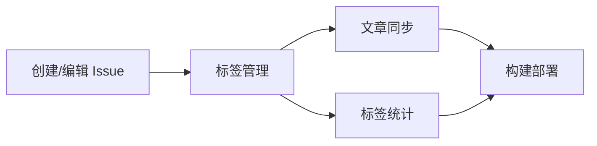

# Cyclone77 博客

基于 GitHub Issues 的现代技术博客，采用 Brutalist 设计风格，使用 React 19 + TypeScript 5 + Vite 6 构建。

## ✨ 特性

- 🎨 **Brutalist 设计风格** - 大胆的黑白对比、粗边框、硬阴影
- 🌓 **深色/浅色主题** - 一键切换，评论区同步切换
- 📱 **完全响应式** - 适配桌面、平板、手机
- 🚀 **GitHub Issues CMS** - 用 Issue 写文章，自动同步
- ⚡ **极速加载** - Vite 构建，代码分割优化
- 🎯 **Apple 风格字体** - SF Pro + 苹方，零延迟加载
- 💬 **Utterances 评论** - 基于 GitHub Issues 的评论系统
- 🗺️ **思维导图导航** - 文章结构可视化
- 📖 **GitHub 风格 Markdown** - 完整的 GFM 支持

## 技术栈

| 技术 | 版本 | 用途 |
|------|------|------|
| React | 19 | UI 框架 |
| TypeScript | 5.7 | 类型安全 |
| Vite | 6 | 构建工具 |
| Tailwind CSS | 3.4 | 样式框架 |
| React Router | 7 | 路由管理 |
| react-markdown | 10 | Markdown 渲染 |
| Utterances | - | 评论系统 |

## 🎨 UI 设计

### Brutalist 风格特点

- **粗边框**: 2-4px 黑色/白色边框
- **硬阴影**: `4px 4px 0px` 偏移阴影
- **高对比**: 黑白为主，Matrix 绿 (#00FF41) 点缀
- **无圆角**: 方正的几何形状
- **大字体**: 清晰的层级结构

### 交互效果

- **Hover**: 元素上浮 + 阴影增大
- **Active**: 元素下沉 + 阴影减小
- **RadialMenu**: 右下角快捷菜单（返回首页/评论/顶部）

## 📝 如何发布文章

### 1. 创建文章

在 GitHub 仓库创建 Issue，编写 Markdown 内容。

### 2. 添加标签

**分类标签**（绿色，至少选一个）:
- `分类:前端开发`、`分类:后端开发`、`分类:DevOps`
- `分类:人工智能`、`分类:系统设计`、`分类:教程`

**功能标签**（紫色，可选）:
- `功能:置顶` - 首页置顶
- `功能:精选` - Hero 区域展示
- `功能:热门` - 热门推荐

### 3. 发布

添加 `状态:已发布` 标签，GitHub Actions 自动构建部署。

## 🚀 本地开发

```bash
# 安装依赖
npm install

# 开发环境
npm run dev

# 构建
npm run build

# 测试
npm test

# 预览
npm run preview
```

## 📁 项目结构

```
src/
├── components/          # 组件
│   ├── ArticleCard.tsx      # 文章卡片
│   ├── ArticleSidebar.tsx   # 文章侧边栏
│   ├── BrutalistCodeBlock.tsx # 代码块
│   ├── BrutalistHeader.tsx  # 页头
│   ├── Comments.tsx         # 评论组件
│   ├── RadialMenu.tsx       # 快捷菜单
│   └── ...
├── pages/               # 页面
│   ├── HomePage.tsx         # 首页
│   └── ArticleDetailPage.tsx # 文章详情
├── contexts/            # Context
│   └── ThemeContext.tsx     # 主题管理
├── services/            # 服务
│   └── api.ts              # API 请求
├── test/                # 测试
└── index.css            # 全局样式
```

## ⚙️ 自动化流水线



| 工作流 | 触发条件 | 功能 |
|--------|----------|------|
| issue-label-manager | Issue 创建/标签变更 | 自动添加草稿标签，状态互斥 |
| sync-articles | Issue 变更 | 同步文章到 JSON |
| sync-tags | 标签变更 | 更新标签统计 |
| deploy-site | 同步完成 | 构建并部署到 Pages |

## 🔧 配置

### GitHub Pages

1. `Settings` → `Pages` → Source 选择 `GitHub Actions`

### 初始化标签

运行 `Actions` → `Initialize Labels` 工作流

## 📊 测试

```bash
npm test
```

- 60 个测试用例
- 覆盖组件、主题、属性测试

## License

MIT
